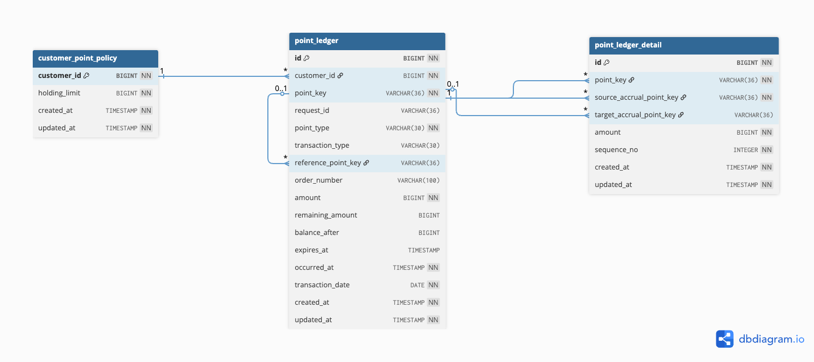

# 무신사 무료 포인트 시스템

## 프로젝트 개요

고객별 무료 포인트의 일반 적립, 관리자 수기 적립, 적립 취소, 주문 사용, 전체·부분 사용 취소를 제공한다.<br/>
통합 원장과 원장 상세로 사용 금액이 어느 적립에서 차감되고 어디로 복원되는지 1포인트 단위로 추적할 수 있다.

## 목차

- [기술 스택](#기술-스택)
- [빌드와 실행](#빌드와-실행)
- [핵심 정책](#핵심-정책)
- [설계 및 정합성 보장](#설계-및-정합성-보장)
  - [데이터 모델과 통합 원장](#데이터-모델과-통합-원장)
  - [ERD](#erd)
  - [동시성·멱등성·트랜잭션](#동시성멱등성트랜잭션)
  - [포인트 차감·복원 시나리오](#포인트-차감복원-시나리오)
  - [AWS-아키텍처](#AWS-아키텍처)
- [API 명세](#api-명세)
- [요청·응답 예시](#요청응답-예시)
- [오류 처리](#오류-처리)
- [테스트](#테스트)
- [설계 고려사항 및 개선 방향](#설계-고려사항-및-개선-방향)

## 기술 스택

| 항목 | 구성 |
| --- | --- |
| Language | Java 21 |
| Framework | Spring Boot 3.5.16 |
| Persistence | Spring Data JPA |
| Database | H2 in-memory, PostgreSQL 호환 모드 |
| API 문서 | springdoc-openapi 2.8.17 |

## 빌드와 실행

```bash
./gradlew clean test
./gradlew bootRun
```

- Swagger UI: <http://localhost:8080/swagger-ui/index.html>
- OpenAPI JSON: <http://localhost:8080/v3/api-docs>
- H2 Console: <http://localhost:8080/h2-console>
  - JDBC URL: `jdbc:h2:mem:points`
  - 사용자: `sa`
  - H2는 인메모리 DB이므로 애플리케이션 재기동 시 데이터가 초기화됨

## 핵심 정책

> 과제 요구사항에서 상세 기준이 정해지지 않은 항목은 일관된 구현을 위해 별도의 기준을 정해 적용했다.

| 기능        | 정책                                                                                                                             |
|-----------|--------------------------------------------------------------------------------------------------------------------------------|
| 적립        | 1회 적립 한도와 고객 보유 한도 체크<br/>일반 적립과 관리자 수기 적립을 구분<br/>만료일은 최소 1일 이상 최대 5년 미만이며 유효기간 생략 시 365일 적용                                  |
| 적립 만료 판정  | `now >= expiresAt`부터 만료로 판정                                                                                                    |
| 적립 취소     | 부분 취소를 지원하지 않음<br/>원적립 전액이 남아 있고 만료되지 않았을 때만 취소 가능<br/>이전에 사용되었더라도 사용 취소로 전액 복원된 경우에는 취소 가능                                    |
| 사용        | 수기 적립 → 만료일 오름차순 → 적립 시각 오름차순 → `id`(PK) 오름차순으로 차감                                                                             |
| 사용 취소     | 전체·부분 취소를 지원<br/>원사용 상세에서 먼저 차감된 포인트부터 FIFO 방식으로 복원<br/>누적 취소액은 원사용 금액을 넘을 수 없음<br/>`사용 취소 금액 + 현재 잔액 > 고객 보유 한도`인 경우 요청 실패 처리 |
| 만료 포인트 복원 | 원적립이 만료된 경우 유효기간 7일의 신규 적립을 생성<br/>해당 재적립에는 1회 적립 한도를 적용하지 않음                                                                  |
| 중복 요청 방지  | 모든 포인트 변경 요청은 `requestId`로 중복 처리를 방지<br/>동일한 `requestId`에 다른 정보를 보내면 충돌로 처리                                                    |
| 주문번호      | 사용 주문번호와 취소 주문번호는 외부 거래 식별자로 사용하며 중복을 허용하지 않음                                                                                  |
| 구현 범위     | 인증·인가와 관리자 수기 적립 권한 검증은 과제 구현 범위에서 제외                                                                                          |


## 설계 및 정합성 보장

### 데이터 모델

#### ERD



#### 테이블 구성

| 테이블                     | 역할                                                                      |
| ----------------------- |-------------------------------------------------------------------------|
| `customer_point_policy` | 고객별 포인트 보유 한도를 관리                                                       |
| `point_ledger`          | 적립, 적립 취소, 사용, 사용 취소 내역을 저장하는 통합 원장<br/> 적립 원장은 실제로 사용할 수 있는 포인트 단위     |
| `point_ledger_detail`   | 모든 원장에 최소 1건 이상 생성<br/>포인트 사용 및 사용 취소 시 어떤 적립 건에서 얼마가 차감되거나 복원되었는지 저장 |

#### 통합 원장

- 모든 포인트 거래를 `point_ledger`에서 관리한다.
- 적립, 적립취소, 사용, 사용취소 내역을 하나의 원장에서 조회하고 거래 간 관계를 추적할 수 있다.

#### 금액 관리

- `amount`: 거래가 발생했을 때의 금액으로, 생성 이후 변경하지 않는다.
- `remainingAmount`: 적립 원장에서 현재 사용할 수 있는 잔여 금액을 관리한다.
- `balanceAfter`: 해당 거래가 완료된 직후의 고객 포인트 잔액을 저장한다.

#### 엔티티 관계

- JPA 엔티티 간 객체 연관관계는 사용하지 않고 관련 원장의 `pointKey`와 같은 식별자 값을 직접 저장한다.
- 연관관계 로딩과 영속성 전파를 단순화하고, 필요한 데이터는 명시적으로 조회한다. 
- 데이터 간 참조 무결성은 데이터베이스의 외래 키 제약조건으로 보장한다.

### 동시성
- 같은 고객의 변경은 `PESSIMISTIC_WRITE` 비관적 락을 사용해 하나씩 처리한다.
- 다른 고객의 요청은 서로 막지 않는다. 
- 같은 고객 요청이 몰리면 대기 시간이 길어질 수 있으므로 운영에서는 락 대기 시간과 503 오류를 관찰하고 타임아웃을 조정한다.

### 멱등성
- `requestId`는 락 획득 전과 후에 검사한다.
- 재요청 시 `balanceAfter`는 최초 처리 값(스냅샷)을 그대로 반환한다.

### 트랜잭션
- 원장 생성, 원장 상세 생성, 적립 잔여 금액 변경, 만료 복원 적립 생성은 하나의 트랜잭션으로 처리한다. 
- 하나라도 실패하면 전체 롤백한다.

### 정합성
- 현재 잔액은 미만료 적립의 `remainingAmount` 합계로 실시간 계산한다. 
- 별도 잔액을 저장하지 않아 쓰기 정합성을 단순화한다.

### 포인트 차감·복원 시나리오

> 포인트 적립부터 사용 및 사용 취소까지의 흐름을 나타낸 시나리오이며, 사용 취소 시 원적립이 만료된 경우도 포함합니다.<br/>
> 상세 source → target은 원장 상세에 저장되는 포인트의 차감·복원 관계를 의미합니다.

| 원장 | 종류     |   금액 | 상세 source → target                      | 결과                  |
|----|--------|-----:|-----------------------------------------|---------------------|
| A  | 수기 적립  | 1000 | A → A                                   | 잔액 1000             |
| B  | 일반 적립  |  500 | B → B                                   | 잔액 1500             |
| C  | 사용     | 1200 | A → null (1000)<br/>B → null (200)      | 잔액 300              |
| D  | 사용 취소  | 1100 | A → E (1000) - A 만료 케이스<br/>B → B (100) | 잔액 1400             |
| E  | 만료 재적립 | 1000 | E → E                                   | D 상세에 포함, 최상위 목록 제외 |

### AWS 아키텍처


## API 명세

| 기능            | Method | URL                                          | 예시                                |
|---------------|--------|----------------------------------------------|-----------------------------------|
| 고객 한도 생성·변경   | `PUT`  | `/api/v1/point-policies/{customerId}`        | [보기](#example-policy)             |
| 일반 적립         | `POST` | `/api/v1/points/accruals`                    | [보기](#example-accrual)            |
| 관리자 수기 적립     | `POST` | `/api/v1/admin/points/accruals`              | [보기](#example-accrual)            |
| 적립 취소         | `POST` | `/api/v1/points/accruals/cancel`             | [보기](#example-accrual-cancel)     |
| 주문 사용         | `POST` | `/api/v1/points/uses`                        | [보기](#example-use)                |
| 사용 취소         | `POST` | `/api/v1/points/uses/cancel`                 | [보기](#example-use-cancel)         |
| 현재 잔액         | `GET`  | `/api/v1/points/balance`                     | [보기](#example-balance)            |
| 거래 내역         | `GET`  | `/api/v1/points/transactions`                | [보기](#example-transactions)       |
| 원장 상세         | `GET`  | `/api/v1/points/transactions/{pointKey}`     | [보기](#example-transaction-detail) |
| 적립 건 사용·복원 이력 | `GET`  | `/api/v1/points/accruals/{pointKey}/history` | [보기](#example-accrual-history)    |

- `fromDate`, `toDate`는 `yyyyMMdd` 형식이다.
- 거래 내역 조회의 기본값은 `page=0`, `size=20`이며, `size`는 1~100 범위다.
- 일반·수기 적립의 `validityDays`는 선택 필드다. 생략 시 365일을 적용하며, 1일 이상 5년 미만이어야 한다.

> 각 API는 [point-api.http](point-api.http) 파일을 통해 테스트할 수 있습니다.

## 요청·응답 예시

API 표의 `보기` 링크로 필요한 예시만 펼쳐볼 수 있다. 모든 변경 API의 성공 상태는 `200 OK`다.
각 예시는 요청·응답 형식을 보여주기 위한 독립된 예시이며, 필요한 고객 정책과 포인트 원장은 미리 준비된 것으로 가정한다.

<a id="example-policy"></a>
<details>
<summary><strong>고객 한도 생성·변경</strong></summary>

```http
PUT /api/v1/point-policies/100
Content-Type: application/json

{ "holdingLimit": 100000 }
```

```json
{ "customerId": 100, "holdingLimit": 100000 }
```
</details>

<a id="example-accrual"></a>
<details>
<summary><strong>일반·관리자 수기 적립</strong></summary>

일반 적립은 `/api/v1/points/accruals`, 관리자 수기 적립은 `/api/v1/admin/points/accruals`를 사용한다. 요청과 응답 형식은 같다.

```http
POST /api/v1/points/accruals
Content-Type: application/json

{
  "requestId": "11111111-1111-1111-1111-111111111111",
  "customerId": 100,
  "amount": 1000,
  "validityDays": 365
}
```

```json
{
  "pointKey": "aaaaaaaa-aaaa-aaaa-aaaa-aaaaaaaaaaaa",
  "customerId": 100,
  "pointType": "ACCRUAL",
  "referencePointKey": null,
  "orderNumber": null,
  "amount": 1000,
  "balanceAfter": 1000,
  "occurredAt": "2026-07-22T10:00:00+09:00",
  "transactionDate": "20260722",
  "expiresAt": "2027-07-22T10:00:00+09:00"
}
```
</details>

<a id="example-accrual-cancel"></a>
<details>
<summary><strong>적립 취소</strong></summary>

```http
POST /api/v1/points/accruals/cancel
Content-Type: application/json

{
  "requestId": "22222222-2222-2222-2222-222222222222",
  "customerId": 100,
  "accrualPointKey": "aaaaaaaa-aaaa-aaaa-aaaa-aaaaaaaaaaaa"
}
```

```json
{
  "pointKey": "bbbbbbbb-bbbb-bbbb-bbbb-bbbbbbbbbbbb",
  "customerId": 100,
  "pointType": "ACCRUAL_CANCEL",
  "referencePointKey": "aaaaaaaa-aaaa-aaaa-aaaa-aaaaaaaaaaaa",
  "orderNumber": null,
  "amount": 1000,
  "balanceAfter": 0,
  "occurredAt": "2026-07-22T10:10:00+09:00",
  "transactionDate": "20260722",
  "expiresAt": null
}
```
</details>

<a id="example-use"></a>
<details>
<summary><strong>주문 사용</strong></summary>

```http
POST /api/v1/points/uses
Content-Type: application/json

{
  "requestId": "33333333-3333-3333-3333-333333333333",
  "customerId": 100,
  "orderNumber": "ORDER-A1234",
  "amount": 1200
}
```

```json
{
  "pointKey": "cccccccc-cccc-cccc-cccc-cccccccccccc",
  "customerId": 100,
  "pointType": "USE",
  "referencePointKey": null,
  "orderNumber": "ORDER-A1234",
  "amount": 1200,
  "balanceAfter": 300,
  "occurredAt": "2026-07-22T10:20:00+09:00",
  "transactionDate": "20260722",
  "expiresAt": null
}
```
</details>

<a id="example-use-cancel"></a>
<details>
<summary><strong>사용 취소</strong></summary>

```http
POST /api/v1/points/uses/cancel
Content-Type: application/json

{
  "requestId": "44444444-4444-4444-4444-444444444444",
  "customerId": 100,
  "usePointKey": "cccccccc-cccc-cccc-cccc-cccccccccccc",
  "cancelOrderNumber": "ORDER-A1234-CANCEL-1",
  "amount": 1100
}
```

```json
{
  "pointKey": "dddddddd-dddd-dddd-dddd-dddddddddddd",
  "customerId": 100,
  "pointType": "USE_CANCEL",
  "referencePointKey": "cccccccc-cccc-cccc-cccc-cccccccccccc",
  "orderNumber": "ORDER-A1234-CANCEL-1",
  "amount": 1100,
  "balanceAfter": 1400,
  "occurredAt": "2026-07-23T10:20:00+09:00",
  "transactionDate": "20260723",
  "expiresAt": null
}
```
</details>

<a id="example-balance"></a>
<details>
<summary><strong>현재 잔액 조회</strong></summary>

```http
GET /api/v1/points/balance?customerId=100
```

```json
{
  "customerId": 100,
  "balance": 1400,
  "calculatedAt": "2026-07-23T10:30:00+09:00"
}
```
</details>

<a id="example-transactions"></a>
<details>
<summary><strong>거래내역 조회</strong></summary>

```http
GET /api/v1/points/transactions?customerId=100&pointType=ACCRUAL&page=0&size=1
```

```json
{
  "content": [
    {
      "pointKey": "ffffffff-ffff-ffff-ffff-ffffffffffff",
      "customerId": 100,
      "pointType": "ACCRUAL",
      "transactionType": "NORMAL",
      "amount": 500,
      "remainingAmount": 400,
      "balanceAfter": 1500,
      "status": "PARTIALLY_AVAILABLE",
      "expiresAt": "2027-07-22T10:05:00+09:00",
      "occurredAt": "2026-07-22T10:05:00+09:00",
      "transactionDate": "20260722"
    }
  ],
  "page": 0,
  "size": 1,
  "totalElements": 2,
  "totalPages": 2
}
```
</details>

<a id="example-transaction-detail"></a>
<details>
<summary><strong>원장 상세 조회</strong></summary>

아래의 `ffffffff-...` 적립은 대표 시나리오의 일반 적립 B를 뜻한다.

```http
GET /api/v1/points/transactions/dddddddd-dddd-dddd-dddd-dddddddddddd
```

```json
{
  "pointKey": "dddddddd-dddd-dddd-dddd-dddddddddddd",
  "customerId": 100,
  "pointType": "USE_CANCEL",
  "referencePointKey": "cccccccc-cccc-cccc-cccc-cccccccccccc",
  "orderNumber": "ORDER-A1234-CANCEL-1",
  "amount": 1100,
  "balanceAfter": 1400,
  "status": "USE_CANCEL",
  "occurredAt": "2026-07-23T10:20:00+09:00",
  "transactionDate": "20260723",
  "details": [
    {
      "sourceAccrualPointKey": "aaaaaaaa-aaaa-aaaa-aaaa-aaaaaaaaaaaa",
      "targetAccrualPointKey": "eeeeeeee-eeee-eeee-eeee-eeeeeeeeeeee",
      "amount": 1000,
      "sequenceNo": 1
    },
    {
      "sourceAccrualPointKey": "ffffffff-ffff-ffff-ffff-ffffffffffff",
      "targetAccrualPointKey": "ffffffff-ffff-ffff-ffff-ffffffffffff",
      "amount": 100,
      "sequenceNo": 2
    }
  ]
}
```
</details>

<a id="example-accrual-history"></a>
<details>
<summary><strong>적립 건 사용·복원 이력 조회</strong></summary>

```http
GET /api/v1/points/accruals/aaaaaaaa-aaaa-aaaa-aaaa-aaaaaaaaaaaa/history
```

```json
{
  "accrualPointKey": "1781aa55-c3d0-484b-a31c-c83c59e05880",
  "transactions": [
    {
      "pointKey": "1781aa55-c3d0-484b-a31c-c83c59e05880",
      "customerId": 200,
      "pointType": "ACCRUAL",
      "transactionType": "MANUAL",
      "amount": 1000,
      "allocatedAmount": 1000,
      "remainingAmount": 0,
      "balanceAfter": 1000,
      "status": "EXPIRED",
      "expiresAt": "2026-07-25T17:30:09.406029+09:00",
      "occurredAt": "2026-07-25T17:22:34.037457+09:00",
      "transactionDate": "20260725"
    },
    {
      "pointKey": "99bc3652-01a0-4fc8-b6eb-e4e84f43f1ac",
      "customerId": 200,
      "pointType": "USE",
      "orderNumber": "ORDER-ASSIGNMENT-001",
      "amount": 1200,
      "allocatedAmount": 1000,
      "balanceAfter": 300,
      "status": "PARTIALLY_CANCELED",
      "occurredAt": "2026-07-25T17:23:33.617414+09:00",
      "transactionDate": "20260725"
    },
    {
      "pointKey": "5d0aef7e-ef96-4b83-b564-4311db7559cb",
      "customerId": 200,
      "pointType": "USE_CANCEL",
      "referencePointKey": "99bc3652-01a0-4fc8-b6eb-e4e84f43f1ac",
      "orderNumber": "ORDER-ASSIGNMENT-001-CANCEL-1",
      "amount": 1100,
      "allocatedAmount": 1000,
      "balanceAfter": 1400,
      "status": "USE_CANCEL",
      "occurredAt": "2026-07-25T17:25:32.315974+09:00",
      "transactionDate": "20260725"
    }
  ]
}
```
</details>

## 오류 처리

공통 오류 응답은 `timestamp`, `code`, `message`, `fieldErrors`로 구성한다.

```json
{
  "timestamp": "2026-07-22T10:00:00+09:00",
  "code": "POINT_BALANCE_INSUFFICIENT",
  "message": "사용 가능한 포인트가 부족합니다.",
  "fieldErrors": []
}
```

| HTTP | 코드                                                                                                         | 대표 원인                              |
|------|------------------------------------------------------------------------------------------------------------|------------------------------------|
| 400  | `INVALID_REQUEST`                                                                                          | Bean Validation 실패<br/> UUID·날짜·쿼리 형식 오류 |
| 404  | `POLICY_NOT_FOUND`, `POINT_NOT_FOUND`                                                                      | 고객 정책 또는 원장 미존재                    |
| 409  | `REQUEST_ID_CONFLICT`, `ORDER_NUMBER_CONFLICT`, `ACCRUAL_CANCEL_NOT_ALLOWED`, `USE_CANCEL_AMOUNT_EXCEEDED` | 중복 식별자<br/> 허용되지 않은 취소<br/> 취소 가능액 초과       |
| 422  | `ACCRUAL_AMOUNT_LIMIT_EXCEEDED`, `HOLDING_LIMIT_EXCEEDED`, `POINT_BALANCE_INSUFFICIENT`                    | 적립·보유 한도 또는 사용 가능 잔액 위반            |
| 503  | `LOCK_TIMEOUT`                                                                                             | 고객 정책 락 획득 실패                      |
| 500  | `DATA_INTEGRITY_VIOLATION`, `INTERNAL_ERROR`                                                               | DB 제약 또는 예기치 않은 오류                 |

## 테스트

`./gradlew clean test`는 다음 범주의 검증을 실행한다.

- 도메인: 금액 불변식, 적립 상태, 사용·사용 취소 배분 순서
- 리포지토리: 스키마 제약, FK, UNIQUE, 조회 정렬
- Web MVC: URL, 요청 검증, 성공 응답과 공통 오류 응답
- 프로세스: 적립부터 사용 취소와 만료 재적립까지의 흐름
- 멱등성: 네 가지 변경 기능의 최초 결과 재생과 충돌 입력
- 롤백: 상세·원장·잔여 금액·복원 적립의 원자성
- 동시성: 동시 사용, 동일 `requestId`, 사용 대 적립 취소를 임의의 `sleep` 없이 반복 검증

> 과제에서 제공한 예시 시나리오를 기준으로 포인트 적립, 사용, 부분 사용 취소 및 만료 포인트 재적립 흐름을 [point-assignment-example.http](point-assignment-example.http)에 정리했습니다.
> <br/>애플리케이션 실행 후 해당 파일의 요청을 위에서부터 순서대로 실행하면 전체 흐름을 확인할 수 있습니다.

## 설계 고려사항 및 개선 방향

- FIFO 사용 취소는 과제 예시 재현을 우선한 결정이다. 고객 우선 정책인 LIFO는 별도 요구사항이 있을 때 검토 대상이다.
- 만료 스케줄러와 만료 원장은 구현하지 않는다. 조회 시각 기준으로 만료를 판정한다. 추후 고객 노출용 명시적 만료 이력이 필요하면 만료 스케줄러를 추가한다.
- 현재는 H2를 사용하므로 테이블 파티셔닝을 적용하지 않는다. 운영 환경에서 거래 데이터가 많아질 경우 월 단위 파티셔닝을 검토한다. 파티셔닝 적용 시 거래 식별자의 유일성 보장 방식도 함께 검토해야 한다.
- 현재 잔액은 별도로 저장하지 않고, 사용할 수 있는 적립 포인트의 잔여 금액을 합산하여 조회한다. 구조는 단순하지만 데이터가 많아지면 잔액 조회가 느려질 수 있으므로, 트래픽이 증가하면 고객별 잔액 테이블을 별도로 관리하는 방식을 검토한다.
- 현재는 사용 가능한 적립 원장을 순서대로 조회한 뒤, 각 적립 건의 잔액을 차감하거나 복원하고 원장 상세를 생성한다. 한 고객이 보유한 적립 원장이 많으면 처리해야 하는 데이터와 쿼리 실행 횟수가 증가해 사용 및 사용 취소가 느려질 수 있다. 운영 데이터가 증가하면 쿼리에서 차감·복원 대상과 금액을 계산하고, 일괄 업데이트와 배치 INSERT를 적용해 데이터베이스 접근 횟수를 줄이는 방식을 검토한다.
- 인증과 권한 관리는 과제 구현 범위에서 제외한다. 운영 환경에서는 로그인한 고객이 자신의 포인트만 조회·변경할 수 있도록 검증하고, 관리자 수기 적립 API에는 관리자 권한을 적용해야 한다.